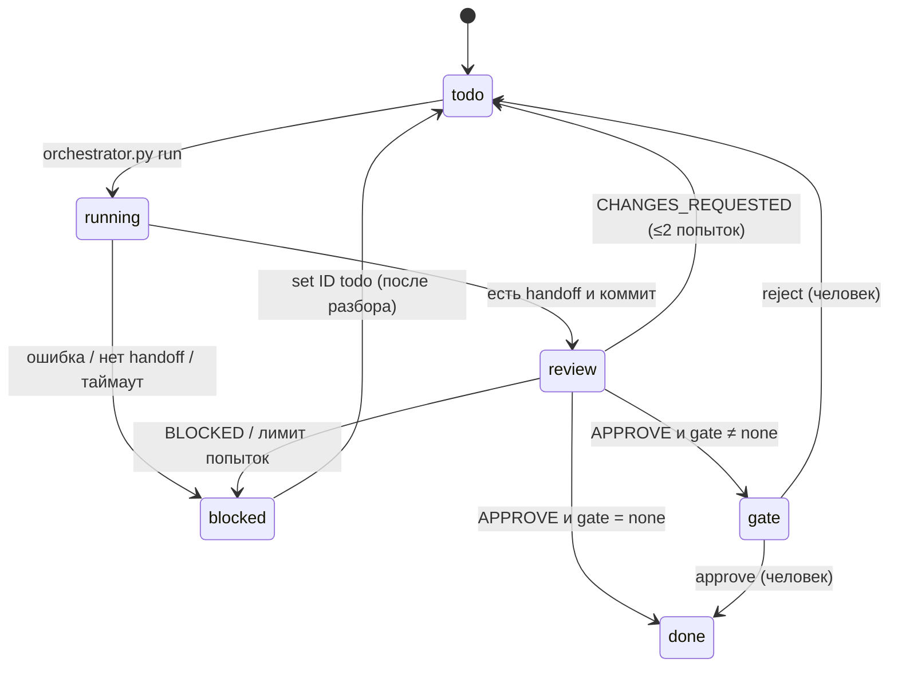

# Протокол взаимодействия агентов

## Жизненный цикл задачи


## Схема взаимодействия
```mermaid
flowchart LR
    H[Вы / продюсер] -- цель спринта --> O[Orchestrator<br/>Claude Code]
    O -- tasks.yaml --> R{Маршрутизатор<br/>orchestrator.py}
    R -->|claude| C[Субагенты Claude:<br/>design, level]
    R -->|codex| X[Codex exec:<br/>gameplay, tech-art, env]
    R -->|kimi| K[Kimi Code:<br/>characters, anim, audio]
    C & X & K -- handoff + commit в task/ID --> V[Кросс-ревью<br/>другой движок]
    V -- APPROVE --> G[Ворота]
    V -- CHANGES --> R
    G -- approve --merge --> M[(main)]
    M -- контекст handoff --> R
    X & C -. MCP .-> UE[Unreal Editor]
    X & C -. MCP .-> B[Blender]
```

## Правила
1. **Изоляция.** Каждая задача — своя ветка `task/<ID>` и git worktree в `../<repo>-wt/<ID>`. Параллельные агенты не мешают друг другу.
2. **Контракт handoff.** Без файла `orchestrator/handoffs/<ID>.md` задача считается проваленной.
3. **Контекст зависимостей.** Оркестратор подмешивает в промпт handoff всех зависимостей (до 6000 символов каждый) — агент не читает чужие логи целиком.
4. **Слияние.** Только после ваших ворот: `approve <ID> --merge`. Следующие задачи создают worktree от обновлённой основной ветки.
5. **Эскалация.** Всё, что агент не может решить сам, идёт в раздел «Открытые вопросы» handoff; оркестратор собирает их в сводку.
6. **Бинарники.** Агенты не редактируют `.uasset/.umap` напрямую — только через Python-скрипты редактора и MCP, которые вы запускаете/подтверждаете.

## Типовой день
```bash
python3 orchestrator/orchestrator.py status
python3 orchestrator/orchestrator.py run --max 4 --parallel 2   # 4 задачи, по 2 одновременно
# … смотрите логи в orchestrator/logs/, handoff и review в orchestrator/handoffs/
# открываете редактор, проверяете то, что на воротах
python3 orchestrator/orchestrator.py approve T-003 --merge
python3 orchestrator/orchestrator.py reject T-008 --note "песок слишком жёлтый, ближе к выбеленной охре"
git add orchestrator/tasks.yaml && git commit -m "board: day N"
```

## Режим «всё внутри Claude Code»
В терминале Cursor: `claude`, затем `/sprint Блокаут пустыни и червь`. Оркестратор-субагент раздаёт задачи своим субагентам, а задачи Codex/Kimi запускает через `orchestrator.py run --task <ID>`.

## Режим «вручную в Cursor»
Открыть задачу из `tasks.yaml`, в чате Cursor написать «Роль: tech-artist, задача T-008». Правила `.cursor/rules` подтянутся по типам файлов. Handoff оформить так же.

## Отладка
- `orchestrator.py prompt T-006` — увидеть точный промпт.
- `orchestrator.py run --task T-006 --no-worktree --no-review` — прогон в текущей папке без ревью.
- `orchestrator.py run --dry-run --max 5` — посмотреть команды без запуска.
- `run --task <ID>` запускает задачу, даже если зависимости не закрыты — используйте осознанно.
