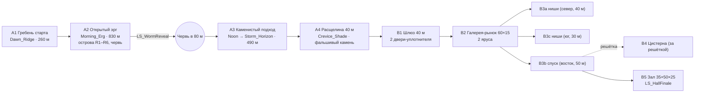

# Схема уровня «Rakis: Heretics» — пустыня Ракиса и сиетч «Табр-ан-Нур»

> Задачи: T-003 (схема + блокаут пустыни и скалы), T-004 (блокаут сиетча). Роль: level-designer + environment-artist.
> **Источник истины для чисел — `Tools/unreal_python/level_layout.py`.** Эта страница пересказывает его для людей;
> при расхождении прав код (его читают блокаут, разметка, генераторы heightmap и скалы).

## 0. Соглашения
- Оси UE: **X — вперёд/восток, Y — вправо/юг, Z — вверх**. Единицы — **сантиметры** (в тексте иногда метры — помечено «м»).
- Ветер (преобладающий): дует **в сторону yaw 60°** (вектор (0.5, 0.866) — на юго-восток). Подветренные склоны дюн и
  «рога» барханов смотрят туда же. Наветренная сторона скалы — северо-запад.
- Уровень земли межбарханных такыров ≈ 0…+6 м (`Z ≈ 0…600`). Гребень старта A1 — 35 м.
- Подуровни: `L_Rakis_Persistent` (разметка) · `L_Rakis_Desert` (A1–A4, initially loaded) · `L_Rakis_Sietch` (B1–B5, грузится зоной A3/A4).
- Теги блокаута: `gen:<script>` + `blockout:<zone>` (зоны: `ground`, `A2`, `A3`, `A4`, `rock`, `far`, `bounds`, `B1`…`B5`).

## 1. Карта сверху

### 1.1 Пустыня (ASCII, 1 символ = 25 м по X × 50 м по Y; сгенерировано из `level_layout.py`)
```
     X(м): -300      -200      -100      0         100       200       300       400       500       600       700       800       900       1000      1100      1200      1300      1400      1500      1600      1700
  -300 |                                                        w
  -150 |                                        H
  -100 |      ^
   -50 |       ^^^^^
     0 |            S....
    50 |                 .....   o
   100 |                      .......                                     ###
   150 |                            .....2..                               #####
   200 |                              o    .!o.W  o                          #####
   250 |                                        .....                        ######
   300 |                                            ....                      ######
   350 |                            B                  o..o                   #######
   400 |                                                   ...                ########
   450 |                                                     =...             ########
   500 |                                                        =..           #########
   550 |                                                          =..  =     ##########
   600 |                                                            =.       ###########
   650 |                                                            = =.     ###########
   700 |                                                               .=..TC########*##
   750 |                                                                 =. ############
   800 |                                                                   #############
   850 |                                                                  ##############
   900 |                                                                 ##############
   950 |                                                                ###############
  1000 |                                                                ##############
  1050 |                                                                 ##########
 Y(м)
```
Легенда: `S` старт A1 · `^` гребень A1 · `.` золотой путь · `2`/`3` точки эллипсисов · `!` точка остановки P4 ·
`W` выход червя (Rakis.Worm.Reveal) · `w` точка покоя червя · `o` камни-«острова» · `B` скелет червя-подростка ·
`H` спайс-комбайн · `=` плиты A3 · `T` стойка тамперов · `C` устье расщелины A4 · `#` «Коготь Шайтана» ·
`*` световая шахта над залом B5 (сиетч под скалой, Z −20…−49 м).

### 1.2 Поток зон (Mermaid)


### 1.3 Сиетч (схема сверху, не в масштабе; X →, Y ↓; Z пола в м)
```
                        B3a (−20, 40 м, ниши W/E ×3, алтарь Шианы)
                           ║
 устье  A4 (0)   B1 0 → −14 ║        B2 галерея: пол −20, U-балкон −14, потолок −6
 ──C══════FR│D1│D2│▼▼▼▼▼▼│═╬══════════════════════════════╗ B3b −20 ▼ −28.5 [альков→решётка] ▼ −37 ║ B5 балкон −37
            шлюз  лестница │ площадка −14 ▼ парадная лестница  ╠════════════════════════════════════════╣ ▼ −42 терраса
                           ║                                ║            │                            ║ ярусы −46.8…−42
                        B3c (−20, 30 м, ниши ×2+2)          ║      B4 цистерна (пол −36,             ║ чаша −48.6 · шахта ↑
                                                            ║      бассейн −40, вода −38)            ║ помост наиба (восток)
```

## 2. Зоны: координаты (см)
| Зона | Что | Центр / AABB (X, Y) | Z | Размер | Погода · музыка |
|---|---|---|---|---|---|
| A1 | стартовый гребень (сейф 35 м, гребень (−15000,−6000)→(24000,9600), yaw 21.8° — прямо на скалу) | X −60000…24000, Y −70000…90000 | гребень 3500 | ~260 м пути | Dawn_Ridge · DesertCalm |
| A2 | открытый эрг: барханы, поперечные гряды, такыры | X 24000…100000, Y −70000…140000 | 0…1500 | 760 м по X (по тропе 830 м) | Morning_Erg · DesertDrone |
| A3w | каменистый подход (полдень) | X 100000…122000 | плиты до 500 | 220 м | Noon_Approach · DesertCalm |
| A3e | подход у скалы + тыл скалы (буря на горизонте) | X 122000…138500 (+ обход вокруг скалы) | — | ~270 м | Storm_Horizon · DesertCalm |
| A4 | скрытая расщелина | X 138500…144500, Y 66000…79000; щель Y 72200…72800 | дно 0 | 40 × 6 м (3 м на 50 м, выше — трещина 0.8 м) | Crevice_Shade · Silence |
| — | «Коготь Шайтана» (pivot меша) | (150000, 60000, 0); ось t∈[−1,1]: Y 10000…110000 | 200–290 м | 1 км × 60–400 м | — |
| B1 | шлюз | X 144500…148500, Y 72300…72700 | 0 → −1400 | 40 × 4 × 4.5 м | Sietch_Interior · SietchNarrow |
| B2 | нижняя галерея (2 яруса) | X 148500…154500, Y 71750…73250 | пол −2000, балкон −1400, потолок −600 | 60 × 15 × 14 м | Sietch_Interior · SietchLife |
| B3a | жилой проход «север» | X 153350…153650, Y 67750…71650 | −2000 | 40 × 3 × 3.5 м + 6 ниш 3×2.5 м | Sietch_Interior · SietchNarrow |
| B3c | жилой проход «юг» | X 153350…153650, Y 73350…76250 | −2000 | 30 × 3 м + 4 ниши | Sietch_Interior · SietchNarrow |
| B3b | главный спуск «восток» | X 154600…159500, Y 72350…72650 | −2000 → −2850 (площадка) → −3700 | 50 × 3 × 3.8 м | Sietch_Interior · SietchNarrow |
| B4 | зал цистерны (за решёткой) | X 156000…159000, Y 73000…75000 | пол −3600, бассейн −4000, вода −3800, потолок −2300 | 30 × 20 м | Sietch_Interior · SietchNarrow |
| B5 | религиозный зал | X 159500…164500, Y 70750…74250 | пол −4800, чаша −4860, свод −2300 | 50 × 35 × 25 м | Hall_Ritual · HallChorale |

**Подробно по B5:** балкон входа X 159500…159900, Y 72100…72900, Z −3700 → лестница X 159900…161000 на террасу −4200 →
5 ярусов-колец вокруг чаши (центр (162500, 72500), полуширина чаши 700, ширина яруса 160, подъём 120:
верх ярусов −4680/−4560/−4440/−4320/−4200) → чаша-песок Ø14 м (Z −4860, бортик R 7–8 м) → помост наиба X 164000…164500 (Z −4200).
Свод: 19 эллиптических рёбер (шаг 250), пята −3800, конёк −2300; полуширина рёбер 1700 → 1450, подъём 1500 → 1300 к востоку
(«глотка» сужается к помосту). Световая шахта: квадрат 400×400 над чашей, труба до Z +500 (через скалу — вырез в меше Ø4 м до вершины).

## 3. Золотой путь: точки и длины
| Точка | X | Y | Z земли | Зона | Отрезок до следующей, м | с при 2.2 м/с |
|---|---|---|---|---|---|---|
| P0_Start | 0 | 0 | 3500 | A1 | 130 | 59 |
| P1_RidgeMid | 12000 | 4800 | 2400 | A1 | 131 | 59 |
| P2_RidgeFoot | 24000 | 9600 | 500 | A1 | 220 | 100 |
| P3_ErgWest | 45000 | 16000 | 300 | A2 | 177 | 81 |
| P4_WormStop | 62000 | 21000 | 200 | A2 | 255 | 116 |
| P5_ErgEast | 85000 | 32000 | 300 | A2 | 180 | 82 |
| P6_ErgEdge | 100000 | 42000 | 400 | A2 | 228 | 104 |
| P7_Plates | 118000 | 56000 | 600 | A3 | 260 | 118 |
| P7b_FinBypass | 134000 | 76500 | 300 | A3 | 76 | 35 |
| P8_CreviceMouth | 140500 | 72500 | 0 | A4 | 38 | 17 |
| P9_FalseRock | 144300 | 72500 | 0 | A4 | 7 | 3 |
| P10_LockChamber | 145000 | 72500 | 0 | B1 | 41 | 18 |
| P11_GalleryBalcony | 148800 | 72500 | −1400 | B1 | 23 | 10 |
| P12_GalleryFloor | 151000 | 72500 | −2000 | B2 | 35 | 16 |
| P13_GalleryEast | 154500 | 72500 | −2000 | B2 | 29 | 13 |
| P14_GrateLanding | 157250 | 72500 | −2850 | B3 | 26 | 12 |
| P15_HallBalcony | 159700 | 72500 | −3700 | B5 | 14 | 6 |
| P16_HallTiers | 161000 | 72500 | −4200 | B5 | — | — |
| **Итого** | | | | | **≈1870 м** | **≈14.2 мин чистой ходьбы** |

## 4. Темп

### 4.1 «Золотой путь» сценария (цель 3:30–3:50) — с двумя эллипсисами
Сценарий (`01_scenario.md`) прыгает по времени суток (06:40 → 08:30 → 11:30): между главами — титр + затемнение +
перенос группы. Без этого 1.6 км до скалы физически не проходятся за 3:40 (нужно ≈12 мин). Поэтому в золотом пути два
переноса (**предложение**, точки `Rakis.Ellipsis.A2/A3` уже стоят, исполняет StoryDirector — см. открытые вопросы):

| Время | Участок | Пройдено | Что происходит |
|---|---|---|---|
| 0:00–0:25 | A1: P0 → +55 м по гребню | 55 м | цепочка, реплика Кайра; скала-силуэт на рассвете |
| 0:25 | **Эллипсис 1** → `Ellipsis_A2` (53400, 18450) | — | титр «Открытый эрг» (4 с, поверх ходьбы) |
| 0:25–1:10 | E2 → P4 | 90 м | 66 м обычным темпом + гул/«Стоять» (замедление, остановка) |
| 1:10–1:40 | `CT_WormReveal` (60500, 20500) | — | LS_WormReveal, 30 с |
| 1:40 | **Эллипсис 2** → `Ellipsis_A3` (138800, 73550) | — | титр «Коготь» |
| 1:40–2:06 | E3 → устье → фальшивый камень | 58 м | диалог с Оссаной в движении (20 м подхода + 38 м расщелины) |
| 2:06–2:33 | B1: камень 3 с + 2 двери по 3 с + 47 м | 47 м | шипение, стража у альковов, смена акустики |
| 2:33–2:59 | B2: балкон → лестница → восточный выход | 58 м | рынок, толпа расступается |
| 2:59–3:16 | B3b до площадки + реплика у решётки (4 с) | 29 м | Рэйн задерживается у решётки |
| 3:16–3:28 | B3b → балкон зала | 26 м | спуск, звук сужается |
| 3:28–3:48 | `CT_HallFinale` на балконе | — | LS_HallFinale ~20 с: облёт → наиб |
| **3:48** | | **≈360 м** | в окне 3:30–3:50 |

### 4.2 Свободная игра (контракт §1.3, 15–20 мин) — без эллипсисов
| Глава | Зона | Расстояние | Темп | Время |
|---|---|---|---|---|
| «Ракис. Гребень Шайтана. Рассвет» | A1 | 260 м | 2.2 м/с + обзор | 2–2.5 мин |
| «Открытый эрг» | A2 | 830 м (+ остров 30 м в сторону) | смесь ходьбы и походки по песку (~1.6–1.8 м/с) | 7–8.5 мин |
| «Шай-Хулуд» | A2 | — | кат-сцена | 0.5 мин |
| «Коготь» | A3 | 490 м | 2.2 м/с по камню | 3.5–4 мин |
| «Табр-ан-Нур» | A4→B1 | 90 м + двери | — | 1 мин |
| — | B2/B3 | 60–150 м | свободная прогулка, ритуал стартует при входе в B3 или через 4 мин в B2 | 2–4 мин |
| «Глотка Бога» | B5 | 40 м | финал | 1 мин |
| **Итого** | | **≈1.9 км** | | **≈17–21 мин** |
Опционально: крюк к комбайну (+700 м, +5 мин) и к скелету (+250 м, +2 мин). Если плейтест > 20 мин без крюков — передвинуть
P7/P7b ближе к скале (сократить A3) или сделать A2-участок P5→P6 короче на 100 м.

## 5. Линии видимости
- **Скала видна со старта.** Из P0 (глаз на 35+1.7 м) скала на 1.53–1.76 км, угловой размер по высоте 5.7° (седло) … **9.4°** (коготь),
  по ширине ~30°. На рассвете солнце на востоке (yaw ≈ 20°) — скала силуэтом против зари. Дюны вдоль тропы занижены коридором
  (×0.25 в 50 м от тропы, плавно до ×1 к 220 м) — ниже линии горизонта гребня. Направление старта (yaw 21.8°) смотрит в центр скалы.
- **Вход в сиетч читается формой, не маркером.** Вогнутая сторона «Когтя» обращена на запад — изгиб ведёт глаз к единственной
  тёмной вертикали у основания; перед устьем — порог из вытертого камня (`CreviceDoorstep`), стойка тамперов наездников (T),
  по краю осыпи нет (устье чистое 25–38 м). **Скрытость:** со старта щель закрыта «плавником» (`CreviceFin`, 25×9×60 м, на линии
  взгляда старт→устье yaw 27.3°, 20 м перед гранью); выше 50 м щель — волосяная трещина 0.8 м (суб-пиксель с 1.5 км).
  Игрок видит вход, только обойдя плавник с юга (P7b).
- Буря `Storm_Horizon` — на юго-западном горизонте (маркер `FX_StormWall` (−60000, 220000)), видна из A3 через плечо.

## 6. Геометрия появления червя
| Что | Значение |
|---|---|
| Точка остановки игрока P4 | (62000, 21000, ~200) |
| Направление на солнце в `Morning_Erg` | **азимут yaw 20°, высота 28°** → `DirectionalLight` (tag `Rakis.Sun`) rotator **(pitch −28, yaw 200)** — задача tech-artist (`light_setup.py`) |
| `Rakis.Worm.Reveal` | P4 + 80 м по yaw 20° = **(69518, 23736, Z земли)**, yaw 200° (пасть к игроку) |
| Перекрытие солнца | тело поднимается на `SurfaceHeight` 50 м: угол верха из глаза = **31.1° > 28°**, ширина 40 м ⇒ ≈28° по горизонтали — солнце закрыто телом, контровой свет сквозь пыль |
| `Rakis.Worm.Spawn` (покой) | **(110000, −30000, −6000)** — 700 м к СВ от P4, под песком на `BurrowDepth` 60 м |
| Траектория Approach | волна идёт с северо-востока (видна на горизонте справа-впереди), загибается к Reveal против солнца |
| Триггер | `CT_WormReveal` (60500, 20500), бокс 30×60×15 м поперёк тропы, за 15 м до P4 |
| Безопасный камень рядом | R3 (63500, 24000) — 33 м от P4: «слишком далеко, чтобы бежать» — напряжение выбора |
| Сухопутная проверка | на 80 м по линии взгляда P4→W нет островов и плит (R3 в 21 м от тропы, но правее линии на ~35°) |

## 7. Камни-«острова» A2 (безопасны: `SurfaceMultiplier Rock = 0`)
| Имя | X | Y | Длина × ширина × высота, см | yaw | До тропы |
|---|---|---|---|---|---|
| R1 | 34000 | 9000 | 1400 × 900 × 220 | 15 | 35 м |
| R2 | 47000 | 20500 | 1800 × 1100 × 300 | 70 | 38 м |
| R3 | 63500 | 24000 | 1500 × 1000 × 260 | 40 | 21 м |
| R4 | 76000 | 24000 | 2000 × 1200 × 340 | 110 | 33 м |
| R5 | 88000 | 38000 | 1300 × 900 × 200 | 5 | 33 м |
| R6 | 97000 | 36000 | 1700 × 1000 × 280 | 60 | 33 м |
Шаг 120–150 м вдоль тропы; каждый в стороне 20–40 м — игрок выбирает: идти по песку ровно или «перепрыгивать» по камням (дольше).

## 8. Укрытия и тень (для гидратации)
| # | Где | Координаты | Когда работает |
|---|---|---|---|
| S1 | подветренная сторона R2 | (46500, 20000) | утро (солнце на востоке → тень на запад) |
| S2 | R4 | (75000, 23500) | утро |
| S3 | плита-навес A3 `PlateArch` | (120500, 58000) | полдень (почти вертикальная тень) |
| S4 | ветровой подрез скалы (навес 3–8 м на высоте 10–30 м) вдоль западной грани | Y 60000…80000, X ≈ грань − 5 м | полдень |
| S5 | расщелина A4 | X 140500…144300 | всегда (полная тень) |
| S6 | корпус комбайна | (70000, −15000) | утро, крюк |

## 9. Маркеры и теги (ставит `level_markup.py`, Persistent)
| Тег | Кол-во | Класс | Где |
|---|---|---|---|
| `Rakis.PlayerStart` | 1 | APlayerStart | (0, 0, 3500 + 98), yaw 21.8° |
| `Rakis.Companion.Ilva` / `.Rayn` | 1/1 | ARakisCompanion (`CompanionId`) | цепочкой за игроком: −3 м / −6 м |
| `Rakis.Companion.Ossana` | 1 | ARakisCompanion | (68018, 23336) — у точки выхода червя |
| `Rakis.Story` | 1 | ARakisStoryDirector | (−1000, 0, 4000) |
| `Rakis.Worm.Spawn` | 1 | TargetPoint (+ ARakisWorm там же, без тега; без C++-червя его спавнит ARakisGameMode по тегу) | (110000, −30000, −6000) |
| `Rakis.Worm.Reveal` | 1 | TargetPoint | (69518, 23736, Z земли), yaw 200 |
| `Rakis.CrowdSpawn` + `.<Archetype>` | **62**: Trader 10, Weaver 8, Artisan 8, WaterCarrier 7, Child 8, Guard 7, Pilgrim 8, Elder 6 | TargetPoint | Trader — за прилавками; ткачи — у станков; водоносы — в цистерне/у площадки решётки/у торговки; дети — круг на рынке (153200, 72500); стража — альковы шлюза, выходы, балкон зала, помост; паломники — балконы B2, B3a, террасы B5; старики — ниши, скамьи |
| `Rakis.HallGather` | **65** (13 × 5 ярусов, без восточной стороны — помост) | TargetPoint | ярусы B5, yaw к чаше |
| `Rakis.SmartObject.Stall` | 8 | TargetPoint | аркада B2-север + балконы |
| `Rakis.SmartObject.Loom` | 6 | TargetPoint | аркада B2-юг + балкон |
| `Rakis.SmartObject.WaterJar` | 8 | TargetPoint | торговка, площадка решётки, цистерна, ниши |
| `Rakis.SmartObject.PrayerMat` | 14 | TargetPoint | 10 на внешних ярусах B5, 4 в нишах |
| `Rakis.SmartObject.Bench` | 8 | TargetPoint | балконы B2, площадка B3b, тупик B3a, терраса B5 |
| `Rakis.SmartObject.Niche` | 10 | TargetPoint | центр каждой ниши B3a/B3c |
| `Rakis.SmartObject.StillsuitRepair` | 2 | TargetPoint | (154050, 73100, −2000), (149200, 73050, −1400) |
| `Rakis.Glowglobe` | **52** | TargetPoint (yaw — в комнату, 2.4 м над полом) | B1 6 · B2 20 · B3 12 · B4 4 · B5 10 |
| `Rakis.POI.<LoreID>` | 11 | ARakisInspectable (`LoreID`) | см. §10 |
| `Rakis.Ellipsis.A2` / `.A3` | 1/1 | TargetPoint | **предложение** (не в контракте) |
| `Rakis.FX.SandTrout` / `.DustDevil` / `.StormWall` | 12/4/1 | TargetPoint | **предложение** для `fx_niagara.py` (ставит `env_scatter_desert.py`) |
Без контрактного тега (только `gen:level_markup`, для Sequencer): `NPC_Harmat` (164250, 72500, −4140), `NPC_Priestess`, `NPC_Dancer` (центр чаши).

## 10. Точки интереса (ARakisInspectable, `LoreID` → DT_Dialogue / лор — game-designer)
| LoreID | X | Y | Z | Что |
|---|---|---|---|---|
| LORE_Harvester_Wreck | 70000 | −15000 | земля+120 | A2: полузанесённый спайс-комбайн (крюк) |
| LORE_Dead_Maker | 40000 | 35000 | земля+120 | A2: выбеленные рёбра червя-подростка |
| LORE_Thumper_Rack | 137500 | 70000 | земля+120 | A3: стойка тамперов наездников у расщелины |
| LORE_Carving_Fremen | 145500 | 72320 | 160 | B1: фрименская резьба (слой 1) за внутренней дверью |
| LORE_Quizarate_Sigil | 149200 | 71770 | −1250 | B2: знак Квизарата (слой 2) у входной площадки |
| LORE_Revivalist_Mural | 152000 | 73230 | −1850 | B2: роспись возрожденцев (слой 3) |
| LORE_Water_Rings | 150800 | 72900 | −1900 | B2: водяные кольца у торговки |
| LORE_Maker_Hooks | 153900 | 71800 | −1900 | B2: стойка крючьев творца |
| LORE_Cistern_Grate | 157250 | 72930 | −2700 | B3b: решётка цистерны (в алькове площадки) |
| LORE_Shiana_Shrine | 153080 | 68300 | −1850 | B3a: домашний алтарь Шианы в западной нише |
| LORE_Worm_Throat | 164400 | 72500 | −4000 | B5: рельеф «глотка Бога» за помостом наиба |

## 11. Объёмы: зоны, звук, навигация, стриминг
### 11.1 ARakisZoneVolume (Persistent; кисть-куб фабрики объёмов 200 см, масштаб = размер / фактический размер кисти — `rakis_common.fit_box_volume`)
| Зона | Боксы (X0…X1, Y0…Y1, Z0…Z1) | WeatherPreset | Music | bInterior | LevelsToLoad | LevelsToUnload |
|---|---|---|---|---|---|---|
| A1 | −60000…24000, −70000…90000, −10000…30000 | Dawn_Ridge | DesertCalm | нет | Desert | Sietch |
| A2 | 24000…100000, −70000…140000, −10000…30000 | Morning_Erg | DesertDrone | нет | Desert | Sietch |
| A3 (запад) | 100000…122000, −70000…170000, −10000…40000 | Noon_Approach | DesertCalm | нет | Desert, **Sietch** | — |
| A3 (восток, 4 бокса вокруг скалы) | 122000…138500 · 138500…190000 × (Y<66000 / Y>79000) · над B1: Z>800 | Storm_Horizon | DesertCalm | нет | Desert, Sietch | — |
| A4 | 138500…144500, 66000…79000, −1000…40000 | Crevice_Shade | Silence | нет | Desert, Sietch | — |
| B1 | 144500…148500, 72000…73000, −1700…700 | Sietch_Interior | SietchNarrow | да | Desert, Sietch | — |
| B2 | 148500…154500, 71500…73500, −2300…−400 | Sietch_Interior | SietchLife | да | Sietch | **Desert** |
| B3 (3 бокса) | B3a 152800…154200 × 67500…71500 · B3c 152800…154200 × 73500…76500 · B3b 154500…159500 × 72000…73000 | Sietch_Interior | SietchNarrow | да | Sietch | Desert |
| B4 | 156000…159000, 73000…75000, −4200…−2200 | Sietch_Interior | SietchNarrow | да | Sietch | Desert |
| B5 | 159500…164500, 70750…74250, −5200…−2100 | Hall_Ritual | HallChorale | да | Sietch | Desert |
`Worm_Tension` / `Worm_Reveal` — не зоны: их запрашивают червь/StoryDirector по состояниям.

### 11.2 Стриминг
- `L_Rakis_Desert`: LevelStreamingDynamic, **initially loaded + visible**; выгружается в B2 (дальше игрок под землёй);
  B1 снова требует Desert (на случай возврата к выходу).
- `L_Rakis_Sietch`: initially **не** загружен; грузится на входе в A3 (≈500 м до устья, ~3–4 мин ходьбы — запас на загрузку),
  выгружается в A1/A2 (возврат назад).
- **Важно:** когда Desert выгружен, небо видно через световые колодцы B2 и шахту B5 — это и есть их свет (скала выгружена).
  Все остальные помещения сиетча замкнуты блокаутом (пол/стены/потолок), чтобы Lumen не «протекал».
- Ландшафт под скалой опущен до −80 м (глубже 15 м от грани), чтобы не пересекать сиетч (−0…−49 м); дно расщелины A4 —
  ровно 0 до фальшивого камня (heightmap и блокаут согласованы).

### 11.3 Реверберация и AudioVolume — по боксам зон B
Реверберацию включает `URakisAudioDirector` по свойству **`ARakisZoneVolume.Reverb`** (скрипт ставит RE_*, если ассет есть).
`AudioVolume` на тех же боксах — только фильтр «снаружи/внутри» (Exterior volume/LPF, глушит ветер пустыни); если C++
модуля нет — реверберация переносится в AudioVolume (`level_markup.place_audio`), чтобы не было двойной.
| Зона | ReverbEffect (создаёт audio-designer) | Volume | Exterior volume / LPF | Приоритет |
|---|---|---|---|---|
| B1 | `/Game/Rakis/Audio/Reverb/RE_Sietch_Airlock` | 0.45 | 0.35 / 1800 Гц | 2 |
| B2 | `RE_Sietch_Gallery` | 0.5 | 0.15 | 1 |
| B3 | `RE_Sietch_Narrow` | 0.4 | 0.1 | 1.5 |
| B4 | `RE_Sietch_Cistern` (длинный влажный хвост) | 0.7 | 0.1 | 2 |
| B5 | `RE_Sietch_Hall` (собор) | 0.8 | 0.05 | 1 |

### 11.4 NavMeshBoundsVolume
`Nav_Sietch` X 140000…165000, Y 66500…77000, Z −5500…1200 (весь сиетч + расщелина); коридор тропы — 9 боксов по отрезкам
P0…P8 с полями 60 м, Z −2000…8000. Вся пустыня не навигируется (экономия) — спутники ходят по коридору.

## 12. Кат-сцены
| Актор | Sequence | Центр | Бокс (см) |
|---|---|---|---|
| CT_WormReveal (ARakisCinematicTrigger) | `/Game/Rakis/Cinematics/LS_WormReveal` | (60500, 20500, земля + 750) | 3000 × 6000 × 1500 |
| CT_HallFinale | `/Game/Rakis/Cinematics/LS_HallFinale` | (159800, 72500, −3450) — балкон входа | 500 × 800 × 500 |

## 13. Ландшафт и генераторы
| Параметр | Значение |
|---|---|
| Heightmap | `Export/heightmap_desert_r16.png`, 16 bit, **4033²**, 1 м/px (4.03 × 4.03 км); те же данные — `Export/heightmap_desert.r16` (uint16 little-endian, строка за строкой Y↓/X→, без заголовка) |
| Landscape Location | актор (угол, вершина 0,0) **(−131600, −151600, 0)**; в поле *Location* окна New Landscape вводится **центр (70000, 50000, 0)** — ядро 2×2 км в центре |
| Landscape Scale | **(100, 100, 100)** → Z = (v − 32768)/128 м, диапазон ±256 м |
| Секции | 63×63 quads, 2×2 секции/компонент, 32×32 компонента |
| Высоты | −80 (под скалой) … ~+60 м (сейфы фона); такыры 0…6 м; гребень A1 35 м |
| Генератор | `python3 Tools/blender/env_dunes.py` (или Blender) → также `Export/heightmap_desert.json` |
| Скала | `blender -b -P Tools/blender/env_rock.py -- --preset default` → `Export/SM_Rock_ShaitanClaw.fbx` (+ `SM_Rock_FalseSlab.fbx`) |
### 13.1 Импорт ландшафта (`landscape_import.py`, шаг build_demo сразу после `env_import`)
Python API UE 5.6 не создаёт Landscape из файла: у `unreal.Landscape`/`LandscapeProxy` нет импорта heightmap и создания
компонентов, `LandscapeEditorSubsystem` в Python нет; `LandscapeProxy.landscape_import_heightmap_from_render_target()` работает
только для уже существующего ландшафта и через render target (ненадёжно на 4033²). Поэтому `landscape_import.py`:
1. ищет в рантайме API импорта (hasattr-пробы `LandscapeEditorSubsystem` и др.) — если будущая версия/плагин его даст, создаёт
   ландшафт сам;
2. иначе печатает в лог пошаговую инструкцию (ниже) и не падает — демо играбельно на фолбэк-земле `env_import.py`;
3. когда Landscape есть — идемпотентно ставит **точный** угол/масштаб из `heightmap_desert.json` (через
   `EditorActorSubsystem.set_actor_transform`), материал `MI_Sand_Erg_Dry` (без LandscapeLayerBlend — LayerInfo не нужны),
   метку `Landscape_Desert`, папку `Rakis/Desert/Landscape`, тег `gen:landscape_import` (маркер «управляется скриптом»;
   ландшафт скрипт **не удаляет**), удаляет фолбэк-плиты и дюны-примитивы (`gen:env_import`, `Ground_*`/`Dune_*`).

**Ручной шаг (≈2 мин):**
1. Открыть `L_Rakis_Persistent`; Window ▸ Levels → двойной клик по `L_Rakis_Desert` (текущий уровень).
2. Режим **Landscape** (список режимов на тулбаре или Shift+2) ▸ вкладка **Manage** ▸ **New** ▸ **Import from File**.
3. *Heightmap File*: `Export/heightmap_desert.r16` (или `heightmap_desert_r16.png` — равноценно).
4. *Location* **70000, 50000, 0** (центр), *Rotation* 0, *Scale* **100, 100, 100**.
5. *Section Size* 63×63 Quads, *Sections Per Component* 2×2, *Number of Components* 32×32 → *Overall Resolution* 4033×4033.
6. *Material* `MI_Sand_Erg_Dry`; *Layers* пусто; *Enable Edit Layers* — по умолчанию. **Import**, затем File ▸ Save All.
7. Запустить `landscape_import.py` и `level_blockout_desert.py` (или `build_demo.py --only landscape_import,level_blockout_desert`).
Если в окне ввели угол вместо центра или другой масштаб — скрипт исправит трансформ сам (данные высот не меняются).

## 14. Порядок запуска (часть build_demo §2.7)
1. Вне UE: `python3 Tools/blender/env_dunes.py` (PNG + `.r16` + JSON); `blender -b -P Tools/blender/env_rock.py`; `… env_worm.py`; `… env_sietch_kit.py`.
2. `env_import.py` → `landscape_import.py` → `level_blockout_desert.py` → `level_blockout_sietch.py` → `level_markup.py` → (light/fx) → `env_dress_sietch.py`, `env_scatter_desert.py`.
Все скрипты повторно запускаемы (удаляют своих акторов по `gen:<script>`).

## 15. Открытые вопросы
1. Эллипсисы золотого пути (§4.1) — нужен ли перенос группы в StoryDirector? Теги `Rakis.Ellipsis.*` и `Rakis.FX.*` — предложение, не контракт.
2. Спутники ставятся акторами `ARakisCompanion` (флаг `PLACE_COMPANION_ACTORS` в `level_markup.py`). Если StoryDirector спавнит их сам по тегам — выключить.
3. Вход в зал на высоте −37 м, пол −48 м: сиетч занимает Z 0…−49 м (контракт «−20…−60 м» соблюдён по смыслу: B2 на −20 м, чаша −48.6 м).
4. Световая шахта зала физически идёт через 220 м скалы; вечерний луч в чашу — фейк tech-artist (Light Function/Spot), т.к. Desert выгружен.

## 9. Web-версия: высокая котловина-сад (C1) — правка S3-garden
Источник чисел — `Web/src/core/layout.js` (`GARDEN`) и `Web/src/garden/layout.js`. Метры, оси three.js (X — восток, Z — юг, Y — вверх).
Сад — **скрытая котловина высоко в скале**, замкнутая отвесными стенами со всех сторон; выхода в пустыню нет. Единственный вход — низкий лаз из выходного туннеля сиетча.

```
        север (−Z)
            ^        стены 46–112 м над дном (гребень, снаружи — крутой склон до пустыни)
   Коготь   |   ┌──────────────┐
  (грань    |   │   дно ≈ 36 м │  r ≈ 34–42 м, центр (832, 398)
  ≥160 м) ══╪═══╡ лаз →        │
   x≈797    |   │  валуны,     │
            |   └──────────────┘
        юг (+Z)
```

| Зона | Размер / высота | Примечание |
|---|---|---|
| Дно котловины | R ≈ 34–42 м (≈ 4 300 м²), y ≈ 35.7–37.5 м (дно 36, подошва осыпи до +1.7 м) | сухая земля + наносы песка, камни, мелкие растения кучками в тени/подветренной стороне валунов |
| Стены | 46–112 м над дном, 9 слоистых полок (глубина 0.35–1.9 м) | на западе — восточная грань «Когтя» (≥ 160 м); полки для птиц и сыча |
| Основание массива | радиус 80–115 м, перепад ≈ 150 м | сплошной склон (подойти/залезть нельзя), прислонён к Когтю |
| Лаз | ≈ 2.0 × 2.25 м, пол y = 36, x = 798.6, z = 395 | без рамы/арки; сечение туннеля сужается к нему на последних ~12 м |
| Выходной туннель сиетча | ≈ 140 м пути, поднимается 30 → 36 м (+6 м), последние 14 м — ровно на восток | зал B5 ↔ сад, без ступеней |

Тайминг: сад не входит в основной хронометраж 3:30–3:50 (побочная зона), но путь зал → лаз ≈ 55 с прогулочным шагом (140 м при 2.5 м/с) и обход дна ≈ 40 с.
Правило видимой цели: вход читается формой (узкая тёмная щель в отвесной грани), не маркером; из пустыни сад не виден (гребень выше любой точки обзора снизу).
