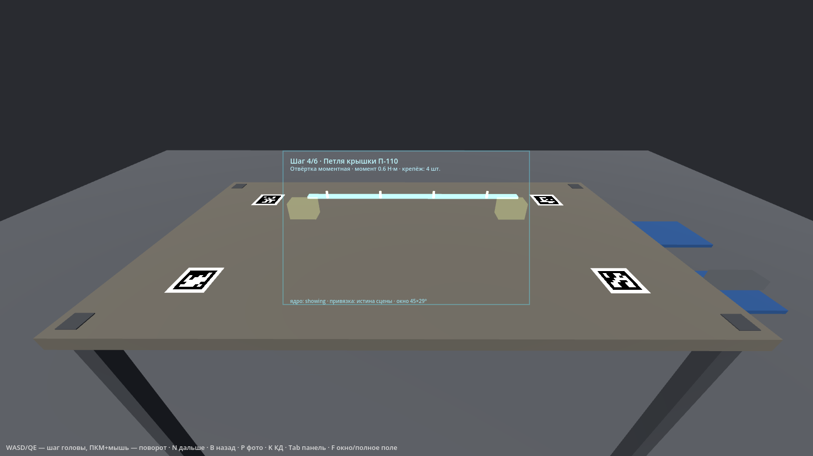

# Godot-клиент и симулятор вида из очков

Godot 4.7, рендер `gl_compatibility` (работает и на слабой ВМ, и программно через llvmpipe).
Сцена собирается кодом из пакета операции — `scenes/main.tscn` только подключает `scripts/main.gd`.



## Что видно на экране
- Вся картинка — «глаз» сборщика (поле ~75° по вертикали): верстак или фюзеляж, метки ArUco, тара, установленные детали.
- Рамка в центре — **дисплей очков 52° по диагонали (≈45×29°)**. Голограммы и HUD видны только внутри неё, как в VITURE
  Luma Ultra. Клавиша **F** — сравнить с «полным полем» (так выглядели бы очки с полем 100°+).
- Голограммы — аддитивный голубой (оптический дисплей не умеет рисовать тёмное), крепёж — жёлтые пульсирующие стержни.
- Внизу рамки — состояние: связь с ядром, источник привязки, размер окна.

## Запуск
```bash
cd pkg1-sim-vm
make godot-assets                        # текстуры меток и GLB-заглушки (один раз)
make sim                                 # ядро (синтетическая камера) + окно Godot
godot --path godot -- --package=$PWD/../data/examples/op070_bin_fuselage.json    # другая операция, без ядра
make sim-test                            # без окна: проверка загрузки → строка SELFTEST
make sim-shot                            # снимок без монитора (xvfb) → out/godot_step4.png
```
Аргументы после `--`: `--package=путь.json`, `--step=N`, `--use-anchor`, `--selftest`, `--screenshot=путь.png`.

Управление: **WASD** — шаг, **Q/E** — вниз/вверх, **ПКМ + мышь** — поворот головы, **Shift** — быстрее;
**N** дальше, **B** назад, **P** фото, **K** лист КД, **Tab** угловая панель (шаги и чат), **F** окно/полное поле, **H** справка.

## Связь с ядром
UDP JSON, `docs/02_hal_contracts.md`: ядро → клиент на 127.0.0.1:47100 (`anchor`, `step`, `chat`, `scale_check`),
клиент → ядро на :47101 (`input`, `head`). Без ядра клиент работает автономно: N/B листают шаги локально.

**Важно про привязку.** В режиме `make sim` кадры ядру даёт синтетическая камера Python, а не камера Godot, поэтому
поза из ядра относится к другой «голове». Клиент по умолчанию ставит голограммы по истине сцены (СК операции = мировая СК).
`--use-anchor` включает постановку по `anchor` от ядра: это режим реальных очков и цель промпта `prompts/08_godot_sim.md`
(Godot сам отдаёт кадры камеры очков ядру, и цикл замыкается).

## Проверено
- Godot 4.7-stable, `--headless --selftest` для пакетов 040 и 070 — без ошибок и утечек.
- `xvfb-run` + Mesa llvmpipe — снимки в `screenshots/`. Ядро + клиент вместе: шаг меняется по команде ядра.

## Что дальше (промпты)
`08_godot_sim.md` — Godot как источник кадров (GodotFrameRig), `09_hud.md` — режимы HUD, лист КД с позицией, эталонные кадры,
`10_chat.md` — чат с сервером по WebSocket, `11_viture_rig.md` — вывод на очки (стерео, калибровка камера↔дисплей).
