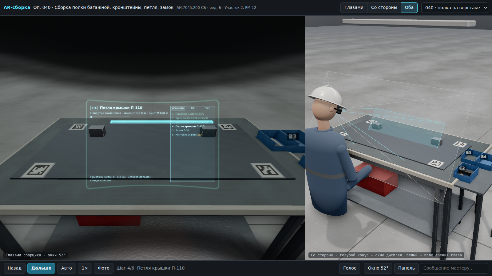

# Пакет 2. Веб-демо: 3D-вид «глазами сборщика» и «со стороны»

Демо для руководства, технологов и обучения. Открывается в браузере, читает **тот же пакет операции** (JSON + GLB + листы КД),
что ядро и очки, и показывает операцию так, как её увидит сборщик в VITURE Luma Ultra: голограммы только в окне дисплея
52° по диагонали (≈45×29°), HUD с шагом, моментом и крепежом, угловая панель «Алгоритм / КД / Чат», затемнение линз,
оправа, нос, размытие периферии. Справа — вид со стороны: голова сборщика, конус окна дисплея, изделие, тара.



## Запуск (5 минут)

Нужен Node.js 22+ (на Ubuntu ставит `pkg1-sim-vm/setup/ubuntu/01_install_base.sh`; на Windows/macOS — с nodejs.org).
```bash
cd pkg2-demo-web
npm install
npm run dev            # http://localhost:5173 — откроется и в сети (--host), можно показать с планшета
```
Перед `dev` и `build` скрипт `scripts/sync-data.mjs` копирует пакеты из `../data/examples` в `public/data`.
GLB-заглушки и условные листы КД делает `cd ../pkg1-sim-vm && make godot-assets` (уже лежат в архиве).

Показ без интернета и без Node: `npm run build` → папка `dist/` — статический сайт, открыть через любой веб-сервер
(`npx vite preview`, nginx, IIS, `python3 -m http.server -d dist`). Шрифты IBM Plex тянутся из Google Fonts, без сети
подставится системный шрифт.

## Управление
| Действие | Кнопка | Клавиша | Голос (Chrome/Edge) |
|---|---|---|---|
| Следующий / предыдущий шаг | Дальше / Назад | N, пробел, → / B, ← | «сборка дальше» / «сборка назад» |
| Автопоказ всей операции | Авто | — | — |
| Скорость анимации 0,5–2× | 1× | — | «сборка быстрее / медленнее» |
| Фото для критичного шага | Фото | P | «сборка фото» |
| Значение (момент, зазор) | поле внизу | Enter | «сборка три и две» → 3,2 |
| Лист КД / чат / панель | Панель | K / C / Tab | «сборка покажи кд», «сборка чат» |
| Окно 52° ↔ полное поле | Окно 52° | F | — |
| Вид: глазами / со стороны / оба | вверху | V | — |
| Осмотреться | перетаскивание в левом виде, двойной щелчок — сброс | | |

Параметры адреса: `?op=040|070&view=eye|side|split&step=4&auto=1&full=1&panel=0&quality=high|low`.
То же короткими метками после `#` (если адресная строка недоступна, например во встроенном просмотре): `#op070-eye-step4-auto-low`.

## Фотореалистичный вид
Сцена рендерится физически корректно (PBR), без внешних текстур — всё генерируется в браузере, демо работает офлайн:
- **Материалы** (`src/scene/materials.js`): шлифованный алюминий, сталь, хром, анодированная плита ложемента, литой
  пластик, интерьерные панели «под кожу», порошковая краска. Материал детали выбирается по имени материала CAD,
  наименованию и типу заглушки (`src/engine/material_rules.js`, покрыто тестами). Острые рёбра коробок скругляются —
  блик по фаске делает деталь «настоящей».
- **Текстуры** (`src/scene/textures.js`): бесшовный фрактальный шум → цвет, шероховатость и нормали: наливной пол цеха
  со следами тележек и швами, антистатический коврик, грунт обшивки, саржа спецодежды.
- **Свет** (`src/scene/environment.js`, `workshop.js`): окружение цеха (ряды светильников, ворота, остекление)
  запекается в карту PMREM — её отражают металл и лак; плюс ключевой свет с мягкими тенями (верхние светильники
  цеха или прожектор на штативе в фюзеляже) и линейные светильники RectAreaLight.
- **Постобработка** (`PhotoChain` в `src/engine/composite.js`): MSAA → затенение в щелях и углах (GTAO) → ореол ярких
  источников (bloom) → тональная компрессия AgX. Голограммы, подписи и конусы в AO не участвуют.
- **Окружение**: верстак со стальным каркасом, ковриком и светильником, стол с лотками; секция фюзеляжа с осью вдоль X
  (шпангоуты 17–19, Z-профили, стрингеры, иллюминаторы, теплоизоляция, пол с рельсами кресел, подставки),
  тележка на колёсах, подъёмник, стеллаж; сборщик в каске, очках и спецодежде.

`?quality=low` отключает AO и bloom и уменьшает тени — для ноутбуков со встроенной графикой.
Голос в демо идёт через Web Speech API браузера (облако производителя браузера) — только для показа. В очках голос
распознаётся офлайн (Vosk, `pkg1-sim-vm`), словарь команд общий — тест сверяет его с Python.

## Симулятор участка: кухонный модуль КМ-2 (`galley.html`)

Фотореалистичная 3D-сцена от первого лица: сборщик приходит на участок, берёт AR-очки с зарядной станции,
надевает их, подходит к стапелю, система привязывается к меткам, и дальше он ведёт сборку кухонного модуля по ТП.
Окна КД, задания с чатом и системы сборщика закреплены в пространстве у стапеля и видны только в окне дисплея очков.
Запуск: `npm run dev` → `http://localhost:5173/galley.html` (или ссылка «Симулятор участка КМ-2» в шапке демо).

**Модуль КМ-2** (`src/galley/spec.js`, условный, по мотивам кормовых кухонь узкофюзеляжных ВС):
1700 × 860 × 2050 мм. Состав:
- 16 сотовых панелей с контурами (S-образная кромка боковин, выпуклые кромки стола, полки и крышки);
- 41 соединение шип-паз, 105 пазов, 44 уголка на 88 винтах во вставки;
- 5 дверец на 12 петлях с поворотными защёлками;
- раковина, кран, сифон, запорный кран;
- облицовка столешницы и фартука нержавеющим листом;
- 2 светильника, печи, кофеварка, кипятильник, щиток автоматов;
- жгуты с хомутами, трубопроводы, узлы крепления к полу и под тяги;
- кромочные профили, декоративная плёнка, окраска, таблички, тележки и контейнеры.

Отсеки рассчитаны под тележку полного размера ≈ 302 × 810 × 1031 мм.

**ТП** (`src/galley/process.js`): 21 операция, 82 перехода с текстом, инструментом, материалами, ссылками
на листы и зоны КД. Есть таймеры: жизнеспособность клея, фиксация 4 ч, межслойная сушка, опрессовка 10 мин.
Есть контроль значений (ширина, диагонали, высота стола, момент, толщина покрытия, изоляция, зазоры дверец)
и фото критичных переходов. Блокирующий таймер не пускает к следующему переходу. Операции 020–050 выполнены
предыдущей сменой: модуль на стапеле уже частично собран.

**КД** (`src/galley/kd_draw.js`) генерируется векторно по той же спецификации, поэтому зум остаётся чётким:
- сборочный чертёж (виды, размеры, позиции, ТТ);
- узлы А–Д (шип-паз, уголок, вставка, крепление к полу, петля);
- схема покрытий, спецификация, схема жгута;
- чертежи панелей с пазами и вставками, маршрут ТП.

Поиск в системе понимает латиницу вместо кириллицы (`KM2.150` → `КМ2.150`).

**Модель зрения** (`src/galley/vision.js`):
- аккомодация с задержкой и возрастной амплитудой, расфокусировка по глубине кадра;
- конфликт вергенции и аккомодации: изображение дисплея всегда на ≈ 4 м;
- зрачок по яркости и возрасту, медленная адаптация к темноте;
- периферия и сумеречный сдвиг, ореолы ламп (растут с возрастом и грязью на линзах), блик от линзы;
- оправа и корпус не в фокусе, нос, затемнение линз, окно дисплея 52° с хроматизмом по краю;
- двоение при неверном межзрачковом расстоянии, задержка голограмм при поворотах, смаз, моргание, усталость.

Пресеты: возраст 52 года, близорукость с колесом диоптрий и вставками и без них, яркий свет, затемнение,
грязные линзы, конец смены.

| Клавиши | |
|---|---|
| WASD, мышь, Shift, C | ходьба, обзор, быстрее, присесть |
| щелчок / колесо / перетаскивание по окну | кнопки, ввод, зум и сдвиг листа КД |
| F, Esc | осмотр точки узла + локальный алгоритм (элементы, переходы, анимация), выход |
| E | надеть очки, открыть / закрыть дверцу |
| N / B, P | переход вперёд / назад, фото |
| G, 1–4 | закрепить окно перед глазами; показать окна |
| I, Shift+I, U | имитация сборки: запуск / пауза, стоп; камера ведёт / хожу сам |
| X, Shift+X | алгоритм в углу поля зрения; другой угол |
| K, R | другие очки; 3DoF — окна по центру взгляда |
| Tab, \\ | поле зрения: полное ≈ 200° / центр 72°; схема зон |
| T, L, V, O, H | ускорение времени, затемнение (ступени очков), снять очки, модель зрения и очки, справка |

Параметры адреса: `?intro=0` — без вступления, `&vision=presby|myopia|myopiaDial|myopiaFull|bright|dimmed|dirty|tired|ipd`,
`&step=090.02`, `&speed=600`, `&glasses=lumaultra|lumapro|beast|air2pro|air2ultra|one|onepro|aura`, `&auto=1`.

### Старт: автономный или ручной режим

Пока сборщик стоит у входа и ещё не двинулся, на стартовом экране выбирается режим:
- **▶ Автономно: от входа до конца сборки.** Сборщик сам идёт через цех к рабочему месту, берёт и надевает
  очки, идёт к стапелю, очки привязываются к меткам. Затем имитация выполняет все переходы задания до предъявления ОТК.
  В любой момент: I — пауза, U — «хожу сам», N/B — вручную.
- **🎮 Ручной режим сразу.** Управление с первого шага. WASD и мышь — дойти до рабочего места, E — взять
  и надеть очки, затем подойти к стапелю (привязка начнётся, когда до него останется ≈ 4 м) и собирать вручную.
- Мелкие кнопки: «Сразу к стапелю: сборка идёт сама, хожу сам» и «Сразу к стапелю, вручную».

Режим можно задать и в адресе: `#autonomous` / `#manual` (`?mode=auto|manual`).

### Вид от третьего лица

Клавиша 5 или кнопка «🧍 Вид от третьего лица». Колесо — ближе или дальше, Shift+колесо — облёт, `#tp`.
Сборщик (`src/galley/humanoid.js`) — процедурная модель человека ≈ 1,78 м (глаза на 1,68 м, как у камеры
от первого лица):
- спецодежда участка: куртка и брюки со светоотражающими полосами, бейдж, перчатки, защитные ботинки;
- ходьба с махом рук, присед (C), наклон к узлу при осмотре, голова поворачивается за взглядом.

На лице — модель выбранных очков. Кабель USB-C с конца левой дужки провисает за ухом к блоку:
- у VITURE — Pro Neckband на шее;
- у XREAL Air и One — Beam Pro на поясе;
- у XREAL Aura — вычислительный блок с тачпадом на поясе.

Голограммы в этом виде не показываются: их видит только сборщик в очках.

### Виртуальная сборка без деталей (плеер)

Клавиша 6, кнопка «🧩 Виртуальная сборка», планшет, голос «сборка виртуальная сборка», `#virtual`.
Реальных деталей и заготовок нет: стеллаж и тележка пустые. Модель собирается на месте настоящих деталей
от пустого стапеля до готового модуля по всем 82 переходам ТП:
- детали текущего перехода подлетают на своё место;
- по ходу перехода появляются клей в пазах, крепёж, окраска и плёнка, включается питание.

Управление как у плеера:
- пуск и пауза (пробел), шаг назад и вперёд (`,` `.`);
- **назад во времени** — разборка (`−`, «сборка назад во времени»);
- скорость ×0,25…×8 (`[` `]`), перемотка ползунком, в начало и в конец (Home/End).

Вид:
- **модель** — реалистичные материалы;
- **голограмма в очках** — модель в слое дисплея: видна только в окне дисплея, контуры рёбер, текущие детали
  янтарные. Так виртуальная сборка выглядела бы в настоящих AR-очках.

Плеер открывается для ближайшего к сборщику места: стапеля или участка.

### Участки цеха: ЭМ-1, СЛ-1, МЭ-1

Кроме стапеля СТ-3 в цехе есть ещё три рабочих места. Перейти: кнопка «📍 Участки», метки
`#em1` `#sl1` `#me1` или параметр `?place=em1`. У каждого участка своя ТП и окно участка: шаги, инструмент,
контроль с допуском, прогресс и кнопки «◂ Назад», «Выполнено ▸», «🧩 Виртуальная сборка». Рядом со
сборщиком (до 4,5 м) клавиши «дальше» и «назад», значение и фото работают для этого участка.
- **ЭМ-1 — сборка жгутов на макете-чертеже 1:1** (12 шагов). Макет 2,4×1,2 м с чертежом: ствол, отводы
  B1–B3, разъёмы XP1–XP5, таблица проводов, основная надпись. Вилки, стойка катушек, автомат резки,
  ESD-стол, перфоэкран с инструментом, паяльная станция, термофен, вытяжка, лупа, прибор прозвонки.
- **СЛ-1 — слесарный участок** (8 шагов, кронштейн КМ2.310.050). Верстак с теневой доской 5S и тисками,
  сверлильный станок 2Н112, точило, реечный пресс 1 т для запрессовки втулок, гидравлический
  листогибочный пресс 40 т со световой завесой. Заготовка переходит между оборудованием: разметка,
  отверстия, гибка, втулки, покрытие.
- **МЭ-1 — монтаж жгутов и электрооборудования модуля без стапеля** (10 шагов). Модуль на ложементе
  с подмостями, тележка с мегаомметром, стойка комплектации, барабан кабеля, наземный источник
  115 В 400 Гц. Шаги: металлизация, укладка жгутов, хомуты, проверка, подача питания.

Оформление: таблички оборудования с инвентарными номерами, знаки безопасности (ESD, «Опасная
зона», «Опасно: электрическое напряжение»), инфостенды участков (мастер, СИЗ, порядок работ),
подвесные вывески. Надписи на текстурах подгоняются по размеру и не обрезаются. На рабочем месте
сборщика есть экран «Система сборщика» со сменным заданием, клавиатура, мышь, лампа и лоток
документов. Табличка зарядной станции меняется по выбранным очкам.

### Имитация сборки и профили очков

**Имитация сборки** — кнопка «▶ Имитация сборки (автоматически)» на стартовом экране, «▶ Имитация сборки (I)»
в панели сверху, кнопка на планшете, голос «сборка запусти сборку» / «пауза» / «стоп имитация», `?auto=1` (`#auto`).
Сборщик сам идёт по переходам ТП с текущего (оп. 060 и далее):
1. голограмма перехода ≈ 3 с, сборщик подходит к месту и смотрит на него;
2. реальная деталь переносится со стеллажа комплектации или тележки на место по дуге (панели, уголки,
   фурнитура, оборудование, раковина, кран, лист, дверцы);
3. замер вводится сам (норма ± доля допуска), фото критичного перехода — в журнал;
4. блокирующая выдержка клея или сушки проматывается ускоренно, таймер виден у узла и в окне;
5. «выполнено» — следующий переход, пока задание не закончится.

I — пауза и продолжение, Shift+I — стоп. N, B или переход с планшета ставят имитацию на паузу.

Два режима камеры (U, кнопка в панели, планшет, голос «сборка хожу сам» / «сборка веди меня»):
- **камера ведёт** — сборщик сам подходит к месту и смотрит на окно перехода и на деталь;
- **хожу сам** — сборка идёт своим ходом (голограммы, перенос деталей, замеры, выдержки), а вы свободно
  ходите и осматриваете участок (WASD, мышь, F — осмотр узла). Кнопка «▶ Имитация: хожу сам» на старте, `#free`.

**Алгоритм в углу поля зрения** (X, Shift+X — другой угол; «сборка алгоритм в угол»; планшет; `#corner`):
компактное окно перехода привязано к голове сборщика в верхнем углу окна дисплея. Видны номер и вид перехода,
название, указание, что нужно для перехода дальше, таймер выдержки. Окно стоит в плоскости виртуального экрана
очков, поэтому нет конфликта вергенции и аккомодации и текст резкий при любом взгляде. Фон почти прозрачный,
шрифт крупный и полужирный. Размер — половина ширины окна дисплея конкретных очков (у Aura крупнее по углу).
В режиме «хожу сам» окно включается автоматически.

**Профили очков** (`src/galley/glasses.js`): K или Shift+K, карточка «Зрение (O)», планшет → «Очки»,
голос «сборка очки иксреал аура», выбор на стартовом экране, `?glasses=aura` или `#aura`.

| Очки | Поле, ° | Окно, ° | Пикс/° | Нит | Трекинг | Затемнение (пропускание) | Вес, г |
|---|---|---|---|---|---|---|---|
| VITURE Luma Ultra | 52 | 44×28 (16:10) | 43 | 1250 | 6DoF, руки | 40 → 0,5 %, 4 ступени | 83 |
| VITURE Luma Pro | 52 | 44×28 | 43 | 1000 | 3DoF | 40 → 0,5 % | 79 |
| VITURE The Beast | 58 | 50×32 | 39 | 1250 | 3DoF | 40 → 0,5 % | 98* |
| XREAL Air 2 Pro | 46 | 40×23 (16:9) | 48 | 500 | 3DoF (хост) | 25 → 0,5 %, 3 ступени* | 75 |
| XREAL Air 2 Ultra | 52 | 46×26 | 42 | 500 | 6DoF, руки | нет | 80 |
| XREAL One | 50 | 44×25 | 44 | 600 | 3DoF в очках, 3 мс | 3 режима* | 84 |
| XREAL One Pro | 57 | 50×29 | 38 | 700 | 3DoF в очках, 3 мс | 3 режима* | 87 |
| XREAL Aura | 70 | 61×41 (16:10) | 31 | 700* | 6DoF, руки | электрохромное* | 95* |

\* — оценка: не опубликовано. В карточке зрения по каждой модели перечислены оценки и источники.

Что меняет профиль:
- окно дисплея: диагональ, формат, смещение. В 46° окно КД 1,2 × 0,86 м целиком видно с 1,5 м, в 70° — с 1,05 м;
- яркость в нитах против света цеха: при 500 нит у Air 2 окна в светлом цеху заметно бледнее;
- пропускание и ступени затемнения (L — по ступеням устройства, затем авто). У Air 2 Ultra затемнения нет;
- оптика: у «birdbath» (Air 2, One, Luma) вторичное отражение и «призрак» окна, мягкий хроматичный край;
  у плоской призмы One Pro бликов почти нет и края резче;
- задержка «движение → фотон»: окна «плывут» при повороте головы (22 мс у хостового 3DoF, 3 мс у One и One Pro);
- трекинг:
  - 6DoF — окна и голограммы закреплены у стапеля, есть привязка к меткам и локальный алгоритм на узле;
  - 3DoF — окна только вокруг головы и переносятся вместе со сборщиком, медленно уплывают (дрейф гироскопа);
    R или «сборка по центру» возвращает их. Голограмм на изделии нет, привязки к меткам нет;
- расстояние до экрана (VAC): у Aura ≈ 2 м (оценка), у остальных ≈ 4 м;
- коррекция зрения: колесо диоптрий до −4 у VITURE, у XREAL только вставки;
- вес на переносице: усталость накапливается за время в очках (Luma Ultra 83 г против Beast 98 г),
  глаз хуже аккомодирует, чаще моргает, слёзная плёнка «мылит».

**Поле зрения двух глаз** (`src/galley/binocular.js`, шейдер в `vision.js`). Tab — переключение режимов,
`\` — схема зон, карточка «Зрение (O)» → «Два глаза и поле зрения».
- **Полное поле ≈ 200°** (по умолчанию) — проекция «как воспринимает человек». Центр показан крупно, примерно
  как вид ~80–90° в игре: рабочая зона, окно перехода и окно дисплея занимают половину экрана. К периферии масштаб
  плавно падает: M(θ) = s0/(1 + θ/25°), по образцу коркового увеличения зрительной коры. Поэтому по краям экрана
  умещается всё поле до ±100°: монокулярные серпы, оправа, открытая периферия. Ради этого к краям есть
  бочкообразное искажение, на плоском мониторе иначе не показать 200°.
  Как это рисуется:
  - центр ±35° — отдельная чёткая камера;
  - периферия — четыре грани куба вокруг головы.
  `?field=0` или `#narrow` — режим «центр 72°» (перспектива, прямые линии).
- **Изображение одно**, как его воспринимает мозг. Физиологическое двоение (вне зоны слияния Panum) мозг
  подавляет, поэтому оно выключено. Его можно включить флажком только для демонстрации: тогда несливаемое
  берётся почти целиком от ведущего глаза, а второе изображение — бледный «призрак».
- **У каждого глаза свои препятствия.** Рамка, переносица, модуль дисплея, дужка и нос находятся в 2–4 см
  от глаза и всегда размыты. Там, где препятствие видит только один глаз, мозг подавляет его в пользу чёткой
  сцены другого глаза. Поэтому переносица и нос видны лишь «призраком», как в жизни.
- **Апертура очков** считается по размерам рамки модели и расстоянию до оптики. Пример для Luma Ultra:
  к носу ≈ 48°, к виску ≈ 58°, вверх ≈ 20°, вниз ≈ 57°.
  - сквозь линзу — затемнение и окно дисплея;
  - вокруг рамки — открытая периферия без затемнения: пол под ногами, проход сбоку;
  - у виска — размытая дужка.
- **Ведущий глаз** весомее в зоне перекрытия. Есть пресеты «Ведущий левый глаз» и «Один глаз».
  Межзрачковое расстояние настраивается от 54 до 74 мм.
- **Острота на периферии** падает линейно: минимальный угол разрешения 1′·(1 + e/2,5°). С 25° от центра
  слабеет цветовое зрение, на дальней периферии падает освещённость сетчатки.
- **Схема зон:**
  - фовеа 2° (жёлтая) и кольца 5°, 10°, 30° — центральное зрение;
  - кольцо 60° — дальше дальняя периферия;
  - зелёным — границы полей глаз, белым — линзы каждого глаза.

**Модели очков** (`src/galley/glasses_model.js`). У рабочего места стоит витрина со всеми восемью очками
в натуральную величину, на зарядной станции лежат выбранные. Из чего собрана модель:
- рамка с вырезами под линзы и аркой переносицы;
- тонированные электрохромные линзы с отблеском просветляющего покрытия;
- оптический модуль в надбровной части: глубокий «birdbath» с наклонным зеркалом или тонкая плоская призма
  X-Prism (One Pro, Aura);
- дужки с динамиками, шарниром и надписью бренда, силиконовые носоупоры;
- колёса диоптрий VITURE, камеры трекинга (Luma Ultra, Air 2 Ultra, Aura), индикатор приватности Aura;
- кабель USB-C, у Aura — вычислительный блок с тачпадом.

Кнопка «🔍 Рассмотреть модель на витрине» в карточке очков или голос «сборка покажи очки» подводят сборщика
к витрине вплотную.

**Раковина.** Штампованная чаша из 12Х18Н10Т:
- отбортовка с завальцовкой ложится на облицовку столешницы и закрывает торец сотовой панели в вырезе;
- стенки с уклоном 2°, скругление дна R25, уклон дна к сливу;
- слив со стаканом, перфорированной решёткой и пробкой;
- по контуру — шов герметика;
- кран с розеткой, аэратором, рычагом и меткой холодной воды.

Ограничение: монитор показывает примерно втрое меньше пикселей на градус, чем дисплей очков.
Разницу в угловой плотности видно по размеру окна и тексту, но не по сетке пикселей.

### Яркость и чёткость окон, голос, планшет

**Окна в очках.** Яркость окон считается физически. Дисплей даёт 1250 нит и складывается со светом цеха
до тональной компрессии, затемняющая плёнка его не ослабляет (калибровка: 1 ед. ≈ 120 кд/м², цех ≈ 500–750 лк).
- Затемнение линз по умолчанию «авто» и следует освещённости. Можно задать вручную: L, голос, планшет.
- Голограммы рендерятся с суперсэмплингом ×2 и лёгким повышением резкости. Окна крупнее, текст полужирный,
  фон окон почти прозрачный, чтобы не давать вуали.
- Z или «сборка приблизь окно» — притянуть окно для чтения и вернуть обратно.

**Голос** (`src/galley/voice_cmd.js`, 8 тестов): слово активации «сборка».
- Переходы: дальше, назад, повтори (с озвучкой), фото.
- Значения цифрами или словами: «тысяча сто пять», «один и шесть десятых».
- КД: лист, зона «б три», увеличь, вписать, контур; поиск по номеру голосом («найди ка эм два сто пятьдесят» → КМ2.150).
- Окна, осмотр, затемнение, яркость, таймеры, вызов мастера, сообщение мастеру.

Каналы ввода:
- 🎤 — распознавание речи браузера (Chrome/Edge, нужен микрофон);
- голосовая строка (Y) — текстом;
- микрофон планшета.

На очках в цеху тот же словарь распознаётся офлайн (Vosk, pkg1).

**Планшет сборщика** (`tablet.html`, `src/galley/tablet.js`):
- переход и таймеры, цифровая клавиатура для контроля, фото;
- ТП (просмотр перехода в очках);
- КД: поиск по номеру, лист, зум, зоны, контур 1:1;
- чат и вызов мастера;
- окна в очках, затемнение, яркость, освещённость, модель зрения, ускорение времени;
- голос с микрофона планшета.

Связь с очками (`src/galley/link.js`), каналы работают одновременно:
- соседняя вкладка или выдвижной планшет в симуляторе (J) — BroadcastChannel;
- отдельное устройство в цеху — сервер участка pkg1: `/ws/remote/{стапель}`
  (`tablet.html?ws=ws://сервер:8080&room=ST3`, симулятор `galley.html?ws=…`);
- опубликованная страница: та же ссылка с `#tablet` на планшете.

Источники характеристик:
- [VITURE Luma Ultra — 52°, 1250 нит, Sony micro-OLED](https://roadtovr.com/?p=173085), [затемнение и коррекция диоптрий](https://heise.de/-10482368), [обзор Luma Ultra](https://www.gamingnexus.com/Article/16314/VITURE-Luma-Ultra/);
- [VITURE Luma / The Beast](https://www.uploadvr.com/viture-luma-viture-the-beast-display-glasses-announce-preorders/), [The Beast](https://arinsider.co/2026/04/28/viture-beast-sets-new-standard-for-video-display-glasses/);
- [XREAL Air 2 Pro](https://www.uploadvr.com/xreal-air-2-pro/), [Air 2 Ultra](https://www.roadtovr.com/xreal-air-2-ultra-ar-glasses-apple-vision-pro/), [One / One Pro — характеристики](https://tutorials.xreal.com/docs/glasses/one-series/spec);
- [XREAL Aura — 70°, Android XR](https://www.xreal.com/us/blog/aura-25-tas-release-en), [сводка](https://www.arcompare.com/ar-glasses/xreal-project-aura/), [запуск осенью 2026](https://www.techtimes.com/articles/319140/20260626/xreal-aura-brings-70-degree-android-xr-glasses-mwc-shanghai-fall-2026-launch-confirmed.htm);
- [размеры тележки полного размера](https://en.wikipedia.org/wiki/Airline_service_trolley);
- [сотовые панели для кухонь ВС](https://www.thegillcorp.com/product/gillfab-4022/), [заделка кромок «ditch and pot»](https://image-ppubs.uspto.gov/dirsearch-public/print/downloadPdf/10155355), [клеи и компаунды для интерьеров](https://multimedia.3m.com/mws/media/1380972O/3m-aerospace-interior-adhesive-solutions-brochure.pdf&fn=3M%20Aerospace%20Interior%20Adhesive%20Solutions%20Brochure.pdf);
- [крепление монументов к полу и тягами](https://patents.justia.com/patent/20130259562).

Все обозначения, режимы и моменты условные.

## Как устроено
```
src/engine/package.js    пакет операции → метры, ссылки, габарит, пол (без three.js, тестируется в node)
src/engine/steps.js      проигрыватель шагов — зеркало движка ядра (состояния, значение/фото, скорость)
src/engine/voice.js      разбор фраз «сборка …», числа словами; обёртка Web Speech API
src/engine/holo.js       материалы голограмм (аддитивные, слой 1), дуга «тара → место», фазы анимации
src/engine/composite.js  вид глазами: окно дисплея 52°, линзы, оправа, нос, моргание, размытие периферии (шейдер)
src/engine/hud.js        HUD в окне дисплея: шаг, инструмент, статус, панель «Алгоритм / КД / Чат»
src/scene/workshop.js    верстак или секция фюзеляжа, тара/тележка/подъёмник, метки ArUco, свет и тени
src/scene/materials.js   библиотека PBR-материалов, материал детали, скругление рёбер
src/scene/textures.js    процедурные текстуры (шум → цвет, шероховатость, нормали)
src/scene/environment.js окружение цеха для отражений (PMREM)
src/engine/material_rules.js  выбор материала по имени CAD / наименованию (без three.js, тестируется)
src/scene/parts.js       детали из GLB по имени узла или заглушки; крепёж; реальная копия + голограмма
src/scene/worker.js      голова и корпус сборщика, конусы окна дисплея и поля зрения (вид со стороны)
src/main.js              сборка всего: раскладка видов, голова, шаги, автопоказ, интерфейс
src/demo_script.js       условные сообщения чата для показа
reference/*.html         эталонные страницы (обзор, вид сборщика, фюзеляж, варианты) — самодостаточные, three.js с CDN
prompts/                 6 промптов развития демо
```
Чтобы показать **свою** операцию: положите пакет в `data/examples/` (или соберите из таблиц технолога
`pkg1-sim-vm/tools/tp_csv_to_json.py`), GLB — в `data/examples/models/`, добавьте строку в `OPS` в `src/main.js`
и пункт в `<select id="opSel">` в `index.html` (промпт 01 делает выбор из списка автоматически).

## Проверка
```bash
npm test                         # vitest: пакет, шаги, голос, материалы, КМ-2, голос КМ-2 (76 тестов)
npm run build && npm run smoke   # настоящий браузер: 21 сценарий (вкл. симулятор КМ-2, участки, планшет, профили очков и имитацию), снимки в test-results/, падает на ошибках консоли
```
Отдельные сценарии: `SMOKE_ONLY=galley_manual,tablet npm run smoke`. Для `smoke` нужен Chromium: `npx playwright install chromium` или `CHROMIUM_PATH=/путь/к/chrome npm run smoke`.
Проверено 01.10.2026: Node 22, three 0.186, Vite 8, Chromium (SwiftShader, без GPU) — 4/4 сценария без ошибок.

## Ограничения демо (честно)
- Привязка к меткам имитируется (через ~2 с «совмещено, 0,8 мм»); настоящая — в ядре `pkg1-sim-vm` по кадрам камеры.
- Детали в примерах — заглушки-параллелепипеды из `parts.fallback` (со скруглёнными рёбрами и PBR-материалами);
  с реальным GLB из NX форма деталей станет «как в жизни».
- Окна дисплеев, оправа и нос — модель восприятия по опубликованным характеристикам, а не измерение конкретных очков.
  Значения с пометкой «оценка» нужно сверить на пилоте.
